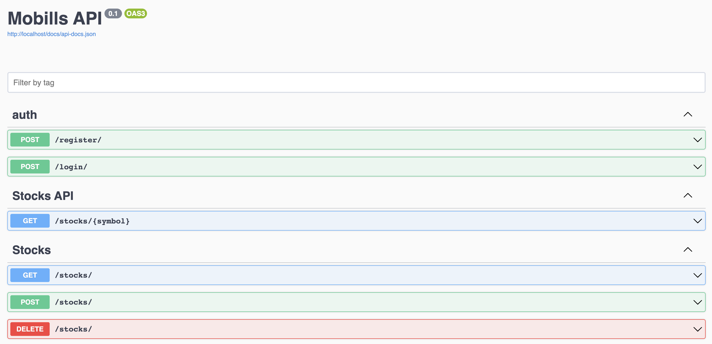
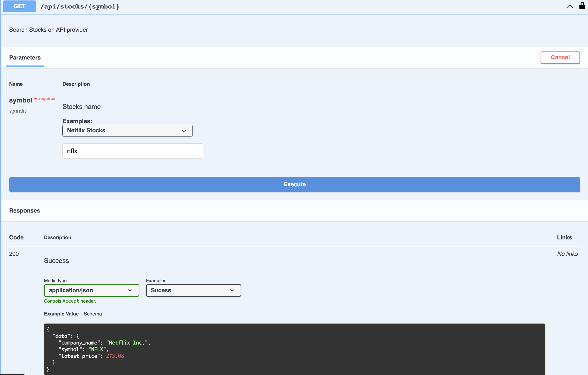
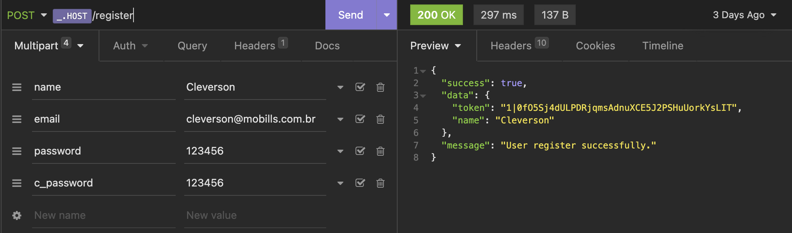
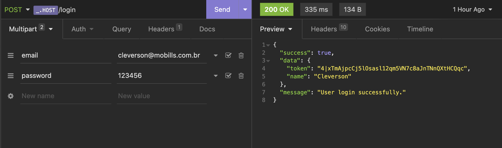
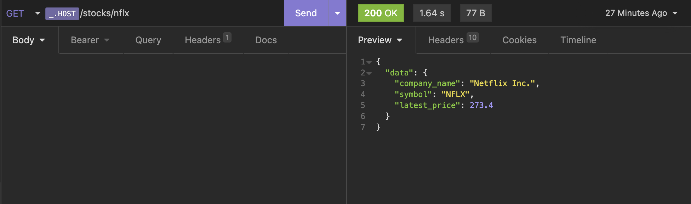
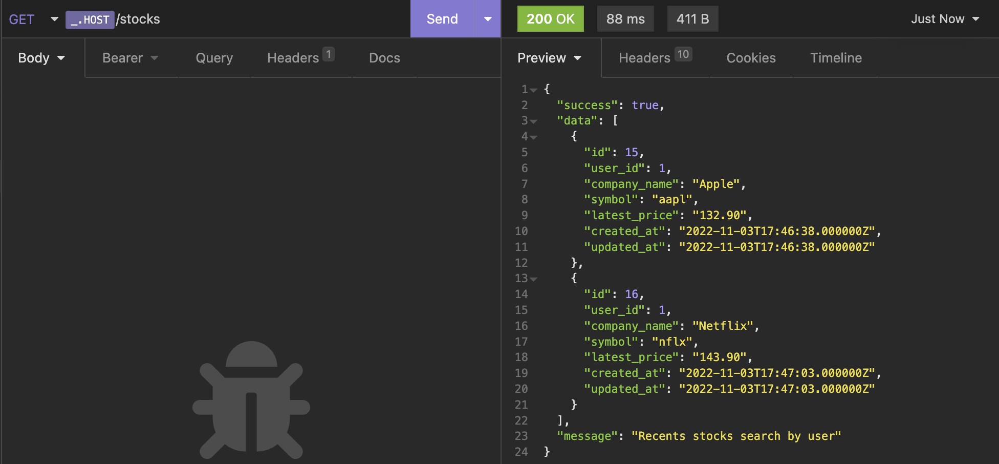
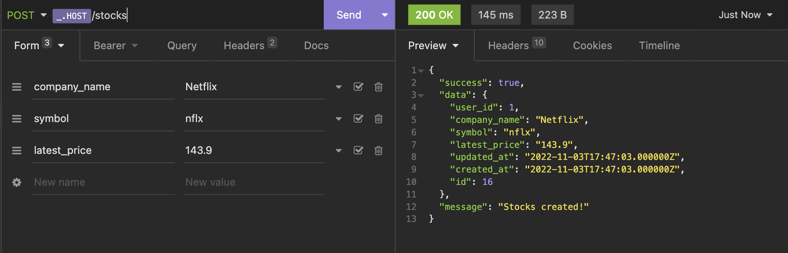
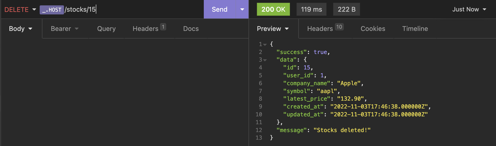

# Cleverson Franco - Code Test


## Rodando Projeto
Instalar dependências
```
docker run --rm --interactive --tty \
  --volume $PWD:/app \
  composer install
```

Se for a primeira vez que estiver rodando o Laravel 9 em sua máquina, primeiro faca o login no Docker para evitar erros.
```
docker login -u user  -p password
```

Adicione no arquivo .env as seguintes credenciais de API
```
STOCKS_API_URL="https://cloud.iexapis.com/stable/"
STOCKS_API_TOKEN="sk_8e127aa96c844fddaee59df2fd25212b"
```

Após isso voce poderá rodar o projeto apenas usando:
```
./vendor/bin/sail up -d
./vendor/bin/sail npm run dev
```
Acesse o projeto em: http://localhost

## Documentação Swagger
http://localhost/api/documentation




## Exemplos
Exemplos de requisições nas rotas

### Auth
#### Criando um usuário

#### Logando em uma conta


### Stocks API
#### Buscando uma ação na API


### Stocks
#### Buscando todos as consultas de um usuário


#### Criando registro de consulta


#### Deletando um registro de consulta

